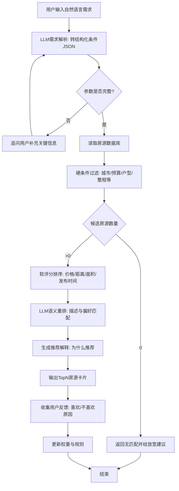

# AI 选房智能体（MVP）需求说明书

> 面向对象：0 基础开发者（PM 背景）  
> 目标：根据用户自然语言需求，实时抓取房源信息并智能匹配

---

## 1. 产品目标与范围

### 1.1 产品目标
构建一个最小可行产品（MVP），支持用户输入自然语言需求后，系统自动完成：
1. 需求解析（自然语言 → 结构化条件）
2. 房源抓取与清洗
3. 条件过滤与智能排序
4. 推荐结果与推荐理由输出

### 1.2 MVP 范围
- 支持 1 个城市、1~2 个房源站点
- 支持基础筛选 + 排序推荐
- 支持推荐解释
- 暂不做：复杂多轮对话、自主规划 Agent、全自动运营后台

---

## 2. MVP 功能清单

### 2.1 用户侧功能（必须）
1. **自然语言需求输入**  
   示例：`预算 6000 内，上海徐汇，两居，地铁 1 公里内，能养猫。`

2. **需求结构化解析**  
   将用户语句解析为结构化字段：预算、区域、户型、地铁距离、宠物偏好等。

3. **推荐结果展示**  
   输出 Top N 房源卡片（标题、价格、位置、面积、匹配分）。

4. **推荐理由展示**  
   每套房显示“为何推荐”的解释信息，增强可信度。

### 2.2 数据侧功能（必须）
5. **房源抓取任务**  
   按固定频率（如每 6 小时）抓取列表页与详情页。

6. **数据清洗与去重**  
   URL 去重、标题+价格+面积指纹去重、异常值处理。

7. **基础数据存储**  
   存储原始抓取数据与结构化数据（MVP 推荐 SQLite）。

### 2.3 匹配引擎功能（核心）
8. **硬条件过滤**  
   预算、城市、户型、整租/合租等硬约束先过滤。

9. **软条件打分排序**  
   按预算贴合度、位置、面积、发布时间等进行加权打分。

10. **LLM 二次重排（建议）**  
    对候选集（如前 20 套）做语义匹配重排，输出最终 Top 5/Top 10。

### 2.4 运维与可控性（基础）
11. **任务日志与失败重试**  
    记录抓取成功率、异常原因、重试结果。

12. **手动兜底开关**  
    支持手动触发抓取、暂停任务，避免系统失控。

---

## 3. 房源抓取数据字典（关键字段）

> 目标：确保可筛选、可排序、可解释。

### 3.1 基础标识字段
| 字段名 | 类型 | 说明 |
|---|---|---|
| listing_id | string | 平台房源唯一 ID |
| source_platform | string | 数据来源平台 |
| source_url | string | 房源详情 URL |
| crawl_time | datetime | 抓取时间 |
| publish_time | datetime | 发布时间（若可获取） |

### 3.2 文本与描述字段
| 字段名 | 类型 | 说明 |
|---|---|---|
| title | string | 房源标题 |
| description_raw | text | 原始描述 |
| description_clean | text | 清洗后描述 |
| tags | array[string] | 标签（近地铁/随时看房等） |

### 3.3 价格与费用字段
| 字段名 | 类型 | 说明 |
|---|---|---|
| price_monthly | number | 月租 |
| price_currency | string | 币种（如 CNY） |
| payment_terms | string | 押一付三等 |
| service_fee | number | 服务费/中介费 |
| price_unit | string | 元/月 或 元/㎡/月 |

### 3.4 户型与面积字段
| 字段名 | 类型 | 说明 |
|---|---|---|
| property_type | string | 住宅/公寓 |
| rent_type | string | 整租/合租 |
| bedrooms | int | 卧室数 |
| living_rooms | int | 厅数 |
| bathrooms | int | 卫数 |
| area_sqm | number | 面积（㎡） |
| floor_info | string | 楼层信息 |
| orientation | string | 朝向 |
| decoration_level | string | 装修程度 |

### 3.5 位置与通勤字段
| 字段名 | 类型 | 说明 |
|---|---|---|
| city | string | 城市 |
| district | string | 区 |
| subdistrict | string | 板块/街道 |
| community_name | string | 小区名 |
| address_text | string | 文本地址 |
| latitude | number | 纬度 |
| longitude | number | 经度 |
| nearest_metro_station | string | 最近地铁站 |
| metro_distance_m | number | 地铁距离（米） |
| commute_time_min | int | 通勤时长（分钟） |

### 3.6 配套与规则字段
| 字段名 | 类型 | 说明 |
|---|---|---|
| facilities | array[string] | 电梯/停车等 |
| appliances | array[string] | 家电配置 |
| pet_policy | string/bool | 宠物政策 |
| smoking_policy | string/bool | 吸烟政策 |
| gender_limit | string | 合租性别限制 |
| available_from | date | 可入住日期 |

### 3.7 质量与风控字段
| 字段名 | 类型 | 说明 |
|---|---|---|
| image_count | int | 图片数量 |
| has_video | bool | 是否有视频 |
| agent_name | string | 经纪人/房东 |
| is_verified | bool | 平台认证标记 |
| data_quality_score | number | 数据完整度评分 |
| duplicate_group_id | string | 去重分组 ID |

---

## 4. 技术路径（0 基础友好）

### 4.1 推荐技术栈
- **后端 API**：FastAPI
- **爬取层**：Crawl4AI（主）+ BeautifulSoup（补充）
- **任务调度**：APScheduler（MVP）
- **数据库**：SQLite（MVP）→ PostgreSQL（扩展）
- **前端展示**：Streamlit（快速原型）
- **大模型能力**：LLM API（需求解析、语义重排、解释生成）

### 4.2 分层职责（建议）
1. **采集层（Crawler）**：抓取列表与详情页
2. **解析层（Parser）**：提取结构化字段并清洗
3. **匹配层（Matcher）**：规则过滤 + 评分排序
4. **智能层（LLM）**：需求理解 + 候选重排 + 推荐解释
5. **服务层（API/UI）**：对外提供查询与展示

### 4.3 Crawl4AI + LLM 的组合方式
- Crawl4AI：负责稳定获取页面内容
- 规则抽取：负责高确定性字段（价格/面积/户型等）
- LLM：负责弱结构字段抽取（宠物政策、限制说明）、需求解析与重排

### 4.4 推荐开发顺序
1. 先做“离线批处理”版本（每日更新）
2. 再做“准实时”更新（每 1~6 小时）
3. 最后再扩展多站点、多城市、个性化反馈学习

---

## 5. 业务流程（Mermaid）

---

## 6. MVP 验收标准（建议）

### 6.1 功能验收
- 能成功解析 80%+ 的自然语言需求到结构化 JSON
- 能从目标站点稳定抓取并入库
- 能输出 Top N 推荐并带解释

### 6.2 数据质量验收
- 关键字段（价格、区域、户型、经纬度）完整率 ≥ 90%
- 去重准确率 ≥ 95%

### 6.3 推荐效果验收
- 用户主观“基本符合需求”比例 ≥ 70%（小样本）

---

## 7. 实施建议（面向 PM/0 基础）

1. 先做“单城市 + 单站点 + 单页面展示”
2. 先用规则确保稳定，再逐步加入 LLM
3. 所有推荐必须可解释，便于调参与复盘
4. 每周复盘：抓取成功率、字段完整率、用户点击/收藏率

---

## 8. 下一步可执行任务清单

- [ ] 设计并确认最终字段 Schema（数据库表）
- [ ] 选定首个房源站点并打通抓取流程
- [ ] 完成需求解析 Prompt 与 JSON Schema
- [ ] 实现过滤与评分函数
- [ ] 搭建 Streamlit 原型页并做首轮内部测试

